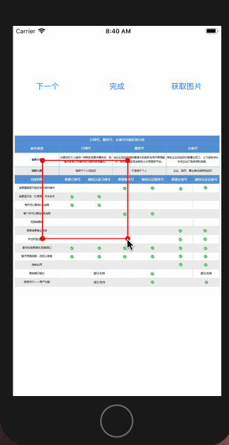

# LabelPicture


#### 要求
- 通过手指触摸屏幕实现画框标注，并实现调整大小及位置。
- 支持画多个框框，每个框框均可以调节大小及位置。
- 画框标注之后，返回每个框框的具体位置。
- 得到第一个框框的截图。

#### 主要方法
```
// 保存当前并开始下一个
public func saveAndNext() -> Void{}

// 完成标注
public func finishDraw() -> NSMutableArray{}

// 截取第一个框框的图片
public func getPicture(complete: @escaping((CGRect,UIImage) ->())) -> Void{}
```


#### 效果如下

